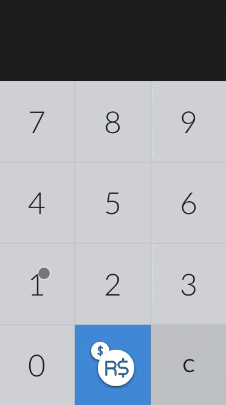

# Currency Converter

Web app that converts currency BRL to USD and vice versa. 

A live demo can be found on [this link](https://currency-converter-oizybkqnhr.now.sh/).

Design and code by [@harlley](https://github.com/harlley)



## Tech Stack

* HTML5
* CSS3 (Grid Layout)
* Vanilla Javascript

## How to Use

To clone and run this application, you'll need [Git](https://git-scm.com) and [Node.js](https://nodejs.org/en/download/) (which comes with [npm](http://npmjs.com)) installed on your computer. From your command line:

```bash
# Clone this repository
$ git clone https://github.com/harlley/currency-converter

# Go into the repository
$ cd currency-converter

# Install dependencies
$ npm install

# Run the app
$ npm start
```

## License

MIT

---

> [harlleyoliveira.com.br](http://harlleyoliveira.com.br) &nbsp;&middot;&nbsp;
> GitHub [@harlley](https://github.com/harlley) &nbsp;&middot;&nbsp;
> Twitter [@harlleydev](https://twitter.com/harlleydev)

